# Complete Website Creation Plan for AI Quiz Structure

**Version:** 3.0
**Last Updated:** 2026-02-13
**Status:** Planning Complete - Ready for Implementation
**Framework:** Next.js 15 + NestJS 10 + PostgreSQL + Redis + RabbitMQ
**Quality Target:** Enterprise Grade (10/10) - 99.99% uptime, SOC 2 ready

---

## 🔒 EXCLUSIVE PORT BOOKING

**10 Ports Exclusively Reserved for AI Quiz Project:**

| Port | Service | Category | Status |
|------|---------|----------|--------|
| 3000 | Web Frontend (Next.js) | Active | 🔒 BOOKED |
| 3001 | API Legacy | Legacy | 🔒 BOOKED |
| 3002 | Web Legacy | Legacy | 🔒 BOOKED |
| 3003 | API Server | Active | 🔒 BOOKED |
| 5433 | PostgreSQL Database | Database | 🔒 BOOKED |
| 5672 | RabbitMQ AMQP | Queue | 🔒 BOOKED |
| 6380 | Redis Cache | Cache | 🔒 BOOKED |
| 9000 | MinIO API | Storage | 🔒 BOOKED |
| 9001 | MinIO Console | Storage | 🔒 BOOKED |
| 15672 | RabbitMQ Management | Queue | 🔒 BOOKED |

**To activate port protection:** Run `.\port-lock-setup.ps1` as Administrator

**See:** `EXCLUSIVE-PORT-BOOKING.md` for complete details

---

## 📊 PROJECT PROGRESS

| Phase | Name | Documentation | Implementation |
|-------|------|---------------|----------------|
| 0 | Infrastructure Planning | ✅ Complete | ⏳ Pending |
| 1 | Project Setup | ✅ Complete | ⏳ Pending |
| 2 | Base HTML Layout | ✅ Complete | ⏳ Pending |
| 3 | CSS Styling | ✅ Complete | ⏳ Pending |
| 4 | JavaScript Core | ✅ Complete | ⏳ Pending |
| 5 | Quiz Module | ✅ Complete | ⏳ Pending |
| 6 | Dad Jokes Module | ✅ Complete | ⏳ Pending |
| 7 | Riddles Module | ✅ Complete | ⏳ Pending |
| 8 | Navigation & Routing | ✅ Complete | ⏳ Pending |
| 9 | Testing & Optimization | ✅ Complete | ⏳ Pending |
| 10 | Deployment | ✅ Complete | ⏳ Pending |

**Overall Progress:** Documentation 100% | Implementation 0%

## Project Overview
This plan outlines the creation of a high-quality website based on the provided AI Quiz structure. The website will feature interactive quizzes, dad jokes, riddles, and various subjects, built with modern web technologies for a 10/10 quality grade.

## Site Structure Tree Diagram

```mermaid
graph TD
    A[Home Page] --> B[Quiz Section]
    A --> C[Dad Jokes Section]
    A --> D[Riddles Section]
    A --> E[About Us]
    A --> F[404 Error Page]

    B --> B1[Single Page Quiz - Science]
    B --> B2[Single Page Quiz - Complete]
    B --> B3[Test All Subjects]

    C --> C1[Classic Dad Jokes]
    C --> C2[Tech Geek Dad Jokes]
    C --> C3[Parenting Dad Jokes]
    C --> C4[Work Office Dad Jokes]

    D --> D1[Chapter 1 - Trick Questions]
    D --> D2[Chapter 2 - Puzzle Stories]
    D --> D3[Chapter 3 - Number Riddles]
    D --> D4[Chapter 4 - Classic Riddles]
    D --> D5[Chapter 5 - Brain Teasers]
    D --> D6[Chapter 6 - Funny Riddles]
    D --> D7[Chapter 7 - Mystery Riddles]
    D --> D8[Chapter 8 - Everyday Objects]
    D --> D9[Chapter 9 - Lateral Thinking]
    D --> D10[Chapter 10 - Wordplay]
    D --> D11[Chapter 11 - Visual Riddles]
    D --> D12[Chapter 12 - Pattern Recognition]
    D --> D13[Chapter 13 - Short & Quick Riddles]
    D --> D14[Chapter 14 - Long Story Riddles]
    D --> D15[Chapter 15 - Kids Riddles]
    D --> D16[Chapter 16 - Hardest Riddles]
    D --> D17[Chapter 17 - Mixed Bag]
    D --> D18[Chapter 18 - Animal Riddles]
    D --> D19[Chapter 19 - Paradox Riddles]
    D --> D20[Chapter 20 - Deduction Riddles]
```



## 🛠️ Technology Stack

### Frontend
| Technology | Version | Purpose |
|------------|---------|---------|
| Next.js | 15 | React framework with App Router |
| React | 18 | UI library with concurrent features |
| TypeScript | 5.x | Type-safe development |
| Tailwind CSS | 3.x | Utility-first styling |
| React Query | 5.x | Server state management |

### Backend
| Technology | Version | Purpose |
|------------|---------|---------|
| NestJS | 10 | Node.js framework with DI |
| TypeORM/Prisma | Latest | Database ORM |
| JWT | Latest | Authentication |
| Redis | 7.x | Caching and sessions |
| RabbitMQ | 3.x | Message queue |

### Infrastructure
| Technology | Purpose |
|------------|---------|
| PostgreSQL | Primary database (Port 5433) |
| Redis | Cache layer (Port 6380) |
| RabbitMQ | Message broker (Ports 5672, 15672) |
| MinIO | Object storage (Ports 9000, 9001) |
| Docker | Containerization |
| Kubernetes | Orchestration |

### Monitoring
| Technology | Purpose |
|------------|---------|
| Prometheus | Metrics collection (Port 9090) |
| Grafana | Dashboards (Port 3004) |
| ELK Stack | Logging (Port 5601) |

---

## 🚀 Quick Start Guide

### Prerequisites
- Node.js 18+ and npm/yarn
- Docker and Docker Compose
- PostgreSQL 15+
- Redis 7+

### Step 1: Activate Port Protection
```powershell
# Run as Administrator
.\port-lock-setup.ps1
```

### Step 2: Initialize Project (To Be Done)
```bash
# Create project structure
mkdir -p apps/frontend apps/backend libs/shared libs/database

# Initialize frontend
cd apps/frontend
npx create-next-app@latest . --typescript --tailwind --app

# Initialize backend
cd ../backend
npm init -y
npm install @nestjs/core @nestjs/common @nestjs/platform-express
```

### Step 3: Start Development
```bash
# Start services with Docker
docker-compose up -d

# Start frontend development
cd apps/frontend && npm run dev

# Start backend development
cd apps/backend && npm run start:dev
```

---

## 📁 Project Structure (Planned)

```
ai-quiz/
├── apps/
│   ├── frontend/              # Next.js 15 Application
│   │   ├── app/               # App Router pages
│   │   ├── components/        # React components
│   │   ├── lib/               # Utilities and helpers
│   │   ├── public/            # Static assets
│   │   └── styles/            # Global styles
│   └── backend/               # NestJS 10 API
│       ├── src/
│       │   ├── modules/       # Feature modules
│       │   ├── common/        # Shared utilities
│       │   ├── config/        # Configuration
│       │   └── database/      # Database setup
│       └── test/              # Backend tests
├── libs/
│   ├── shared/                # Shared types and utilities
│   ├── database/              # Database schemas and migrations
│   └── auth/                  # Authentication logic
├── infrastructure/
│   ├── docker/                # Docker configurations
│   ├── kubernetes/            # K8s manifests
│   └── terraform/             # Infrastructure as Code
├── docs/                      # Documentation
├── scripts/                   # Utility scripts
└── tools/                     # Development tools
```

---

## 📋 Development Phases

### Phase 0: Infrastructure Planning
- **File:** `phase0-infrastructure-planning.md`
- **Status:** ✅ Documentation Complete
- **Port allocation:** See `EXCLUSIVE-PORT-BOOKING.md`
- **Security:** See `port-lock-setup.ps1`

### Phase 1: Project Setup and Architecture
- **File:** `phase1-project-setup.md`
- **Status:** ✅ Documentation Complete | ⏳ Implementation Pending
- **Tasks:**
  - [ ] Initialize monorepo structure
  - [ ] Configure TypeScript
  - [ ] Set up ESLint/Prettier
  - [ ] Configure Docker Compose

### Phase 2: Base HTML Structure and Layout
- **File:** `phase2-base-html-layout.md`
- **Status:** ✅ Documentation Complete | ⏳ Implementation Pending
- **Tasks:**
  - [ ] Create base layout components
  - [ ] Implement header/footer
  - [ ] Set up responsive grid

### Phase 3: CSS Styling and Responsive Design
- **File:** `phase3-css-styling.md`
- **Status:** ✅ Documentation Complete | ⏳ Implementation Pending
- **Tasks:**
  - [ ] Configure Tailwind CSS
  - [ ] Create design tokens
  - [ ] Implement dark mode

### Phase 4: JavaScript Core Functionality
- **File:** `phase4-javascript-core.md`
- **Status:** ✅ Documentation Complete | ⏳ Implementation Pending
- **Tasks:**
  - [ ] Set up state management
  - [ ] Create utility functions
  - [ ] Implement API client

### Phase 5: Quiz Module Implementation
- **File:** `phase5-quiz-module.md`
- **Status:** ✅ Documentation Complete | ⏳ Implementation Pending
- **Tasks:**
  - [ ] Build quiz engine
  - [ ] Implement scoring system
  - [ ] Create question components

### Phase 6: Dad Jokes Module Implementation
- **File:** `phase6-dad-jokes-module.md`
- **Status:** ✅ Documentation Complete | ⏳ Implementation Pending
- **Tasks:**
  - [ ] Create joke categories
  - [ ] Build joke display components
  - [ ] Implement voting system

### Phase 7: Riddles Module Implementation
- **File:** `phase7-riddles-module.md`
- **Status:** ✅ Documentation Complete | ⏳ Implementation Pending
- **Tasks:**
  - [ ] Build 20 riddle chapters
  - [ ] Implement hint system
  - [ ] Create progress tracking

### Phase 8: Navigation and Routing System
- **File:** `phase8-navigation-routing.md`
- **Status:** ✅ Documentation Complete | ⏳ Implementation Pending
- **Tasks:**
  - [ ] Configure Next.js routes
  - [ ] Implement breadcrumbs
  - [ ] Add navigation guards

### Phase 9: Testing, Optimization, and Polish
- **File:** `phase9-testing-optimization.md`
- **Status:** ✅ Documentation Complete | ⏳ Implementation Pending
- **Tasks:**
  - [ ] Write unit tests (90% coverage target)
  - [ ] Add E2E tests
  - [ ] Optimize performance

### Phase 10: Deployment and Documentation
- **File:** `phase10-deployment-documentation.md`
- **Status:** ✅ Documentation Complete | ⏳ Implementation Pending
- **Tasks:**
  - [ ] Set up CI/CD pipeline
  - [ ] Configure Kubernetes
  - [ ] Complete API documentation

---

## 📄 Related Documentation

### Planning Documents
| File | Description |
|------|-------------|
| `PROJECT-PLAN-ANALYSIS.md` | Comprehensive plan analysis |
| `page-plans-overview.md` | Overview of all page plans |

### Page Plans
| File | Description |
|------|-------------|
| `home-page-plan.md` | Home page design |
| `about-us-plan.md` | About page design |
| `404-error-page-plan.md` | Error page design |
| `single-page-quiz-science-plan.md` | Science quiz page |
| `single-page-quiz-complete-plan.md` | Complete quiz page |
| `test-all-subjects-plan.md` | Multi-subject quiz |
| `dad-jokes-section-plan.md` | Dad jokes section |
| `riddles-section-plan.md` | Riddles section |

### Security Documents
| File | Description |
|------|-------------|
| `EXCLUSIVE-PORT-BOOKING.md` | Port reservation details |
| `port-lock-setup.ps1` | Firewall setup script |
| `firewall-protection.ps1` | Firewall rules |
| `SECURITY-README.md` | Security overview |

---

## 🎯 Quality Targets

| Metric | Target | Current |
|--------|--------|---------|
| Documentation | 100% | ✅ 100% |
| Code Coverage | 90% | ⏳ 0% |
| Performance (Lighthouse) | 90+ | ⏳ N/A |
| Accessibility (WCAG) | AA | ⏳ N/A |
| Uptime | 99.99% | ⏳ N/A |

---

## ⚠️ Known Issues & Action Items

1. **Port Conflicts:** Ports 3000/3003 are currently in use by other services
2. **Security Script:** `port-security-monitor.ps1` has syntax errors - needs fix
3. **Missing Files:** `network-security-wall.md` referenced but not created

---

**Last Analysis:** 2026-02-13 - See `PROJECT-PLAN-ANALYSIS.md` for details
